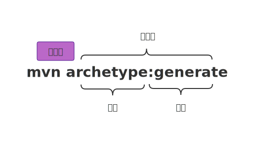
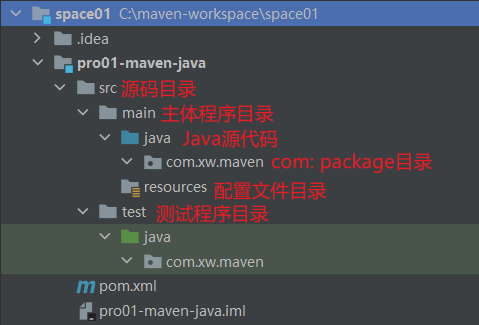

# Maven


`Maven` 是一个**项目管理工具**，可以对 Java 项目进行自动化的**构建**和**依赖**管理。

## 安装与配置

### 解压Maven核心程序

官网: https://maven.apache.org/

下载地址: https://maven.apache.org/download.cgi

下载后解压，并配置环节变量，例如：

```wiki
MAVEN_HOME: C:\Programs\apache-maven-3.8.6

Path: %MAVEN_HOME%\bin
```

[^]: 环节变量配置规律，XXX_HOME通常指向的是bin目录的上一级，PATH指向的是bin目录

在解压目录中，`Maven`的核心配置文件为: **`conf/settings.xml`**

### 指定本地仓库

本地仓库默认值为: `${user.home}/.m2/repository`

若需指定本地仓库地址，配置方式如下

```xml
  <!-- localRepository
   | The path to the local repository maven will use to store artifacts.
   |
   | Default: ${user.home}/.m2/repository
  <localRepository>/path/to/local/repo</localRepository>
  -->
  <localRepository>C:\maven-repository</localRepository>
```

### 配置镜像仓库

`Maven`下载`jar`包默认访问境外的中央仓库，对于国内用户来说速度较慢，改为国内提供的镜像仓库。配置方式如下

```xml
<mirrors>
    <!-- mirror
     | Specifies a repository mirror site to use instead of a given repository. The repository that
     | this mirror serves has an ID that matches the mirrorOf element of this mirror. IDs are used
     | for inheritance and direct lookup purposes, and must be unique across the set of mirrors.
     |
    <mirror>
      <id>mirrorId</id>
      <mirrorOf>repositoryId</mirrorOf>
      <name>Human Readable Name for this Mirror.</name>
      <url>http://my.repository.com/repo/path</url>
    </mirror>
     -->
    <mirror>
      <id>nexus-aliyun</id>
      <mirrorOf>central</mirrorOf>
      <name>Nexus aliyun</name>
      <url>http://maven.aliyun.com/nexus/content/groups/public</url>
    </mirror>
  </mirrors>
```

### 配置Maven工程的基础JDK版本

若按照默认配置允许，`Java`工程使用的默认`JDK`版本是1.5。若需要使用`JDK 1.8`，修改方式如下，将如下`profile`标签复制到`settings.xml`文件的`profiles`标签内

```xml
<profiles>
    <profile>
        <id>jdk-1.8</id>
        <activation>
            <activeByDefault>true</activeByDefault>
            <jdk>1.8</jdk>
        </activation>
        <properties>
            <maven.compiler.source>1.8</maven.compiler.source>
            <maven.compiler.target>1.8</maven.compiler.target>
            <maven.compiler.compilerVersion>1.8</maven.compiler.compilerVersion>
        </properties>
    </profile>
</profiles>
```

## 使用Maven：命令行环境

### 根据坐标创建Maven工程

#### Maven中的坐标

使用三个`向量`在`Maven仓库`中**唯一**的定位到一个`jar`包。

+ `groupId`: 公司或组织的id
+ `artifactId`: 一个项目或者是项目中的一个**模块**的id
+ `version`: 版本号

取值方式：

+ `groupId`: 公司或组织域名的倒序，通常也会加上项目的名称，例如 `com.xw.maven`
+ `artifactId`: 模块的名称，将来作为Maven工程的工程名
+ `version`: 模块的版本号，`SNAPSHOT`表示快照版本，正在迭代过程中，不稳定的版本。`RELEASE`表示正式版本

#### 坐标和仓库中jar包的存储路径之间的对应关系

**坐标**

```xml
<groupId>mysql</groupId>
<artifactId>mysql-connector-java</artifactId>
<version>5.1.49</version>
```

上面**坐标**对应`jar`包在`Maven仓库`中的位置为

```bash
Mavenv本地仓库根目录\mysql\mysql-connector-java\5.1.49\mysql-connector-java-5.1.49.jar

# 若Maven本地仓库为默认地址
${user.home}\.m2\repository\mysql\mysql-connector-java\5.1.49\mysql-connector-java-5.1.49.jar
```

#### 操作

##### 创建目录作为后面操作的工作空间

例如：`C:\maven-workspace\space01`

##### 在工作空间目录打开命令行窗口

```bash
cd C:\maven-workspace\space01
```

##### 生成Maven工程

运行 `mvn archetype:generate` 命令



```bash
Choose a number or apply filter (format: [groupId:]artifactId, case sensitive contains): 7: 
Define value for property 'groupId': com.xw.maven
Define value for property 'artifactId': pro01-maven-java
Define value for property 'version' 1.0-SNAPSHOT: :

[INFO] ----------------------------------------------------------------------------
[INFO] Using following parameters for creating project from Old (1.x) Archetype: maven-archetype-quickstart:1.1
[INFO] ----------------------------------------------------------------------------
[INFO] Parameter: basedir, Value: C:\maven-workspace\space01
[INFO] Parameter: package, Value: com.xw.maven
[INFO] Parameter: groupId, Value: com.xw.maven
[INFO] Parameter: artifactId, Value: pro01-maven-java
[INFO] Parameter: packageName, Value: com.xw.maven
[INFO] Parameter: version, Value: 1.0-SNAPSHOT
[INFO] project created from Old (1.x) Archetype in dir: C:\maven-workspace\space01\pro01-maven-java
[INFO] ------------------------------------------------------------------------
[INFO] BUILD SUCCESS
[INFO] ------------------------------------------------------------------------
[INFO] Total time:  04:17 min
[INFO] Finished at: 2022-10-05T12:21:12+08:00
[INFO] ------------------------------------------------------------------------
```

##### 调整

`Maven`默认生成的工程，对`junit`依赖是较低的`3.8.1`版本，可以改成较合适的`4.12`版本。自动生成的`App.java`和`AppTest.java`可以删除。编辑`pom.xml`文件

```xml
<dependencies>
    <dependency>
        <groupId>junit</groupId>
        <artifactId>junit</artifactId>
        <version>4.12</version>
        <scope>test</scope>
    </dependency>
</dependencies>
```

##### pom.xml

```xml
<!-- project标签：根标签，表示对当前工程进行配置，管理 -->
<project xmlns="http://maven.apache.org/POM/4.0.0" xmlns:xsi="http://www.w3.org/2001/XMLSchema-instance"
  xsi:schemaLocation="http://maven.apache.org/POM/4.0.0 http://maven.apache.org/xsd/maven-4.0.0.xsd">
  <!-- modelVersion标签：从 Maven 2 开始就固定为 4.0.0 -->
  <!-- 表示当前 pom.xml 所采用的标签结构 -->
  <modelVersion>4.0.0</modelVersion>
  
  <!-- 坐标信息 -->
  <groupId>com.xw.maven</groupId>
  <artifactId>pro01-maven-java</artifactId>
  <version>1.0-SNAPSHOT</version>
  
  <!-- packaging标签: 打包方式 -->
  <!-- jar: 生成 jar 包，说明这是一个 Java 工程 -->
  <!-- war: 生成 war 包，说明这是一个 Web 工程 -->
  <!-- pom: 说明这个工程是用来管理其它工程的工程 -->
  <packaging>jar</packaging>

  <name>pro01-maven-java</name>
  <url>http://maven.apache.org</url>

  <!-- 在 Maven 中定义属性值 -->
  <properties>
    <!-- 在构建过程中读取源码时使用的字符集 -->
    <project.build.sourceEncoding>UTF-8</project.build.sourceEncoding>
  </properties>

  <!-- 配置依赖信息 -->
  <dependencies>
    <!-- 具体依赖信息 -->
    <dependency>
      <!-- 通过坐标来配置依赖 -->
      <groupId>junit</groupId>
      <artifactId>junit</artifactId>
      <version>4.12</version>
      
      <!-- scope标签: 配置当前依赖的范围 -->
      <scope>test</scope>
    </dependency>
  </dependencies>
</project>
```

#### Maven 核心概念: POM

##### 含义

`POM`: **P**roject **O**bject **M**odel，项目对象模型。

##### 模型化思想

`POM`表示将工程抽象为一个模型，再用程序中的对象来描述这个模型。这样就可以用程序来管理项目。在开发过程中，最基本的做法就是将现实中的事物抽象为模型，然后封装模型相关的数据为一个对象，这样就可以在程序中计算与现实事物相关的数据。

##### 配置文件

`POM`理念集中体现在`Maven`工程跟目录下`pom.xml`这个配置文件中。`pom.xml`就是Maven工程的核心配置文件。

#### Maven 核心概念: 约定的目录结构

##### 各个目录的作用



另外还有一个`target`目录专门存放构建操作输出的结构。

##### 约定目录结构的意义

`Maven`为了让构建过程能够尽可能自动化完成，所以必须约定目录结构的作用。例如`Maven`执行编译操作，必须先去`Java`源程序目录结构读取`Java`代码，然后执行编译，最后把编译的结构存放在`target`目录。

##### 约定大于配置

`Maven`对于目录结构这个问题，没有采用配置的方式，而是基于约定。这样会让我们在开发过程中非常便捷。如果每次创建`Maven`工程后，还需要针对各个目录的位置进行详细的配置，那肯定非常麻烦。

目前开发领域的技术发展趋势就是: **约定大于配置，配置大于编码。**

### 在Maven工程中编写代码

编写`Calculator`类

```java
package com.xw.maven;

public class Calculator {
    public int sum(int i, int j) {
        return i + j;
    }
}
```

编写测序类`CalculatorTest`

```java
package com.xw.maven;

import org.junit.Test;

// 静态导入
import static org.junit.Assert.*;

public class CalculatorTest {
    @Test
    public void testSum() {
        Calculator calculator = new Calculator();

        int result = calculator.sum(5, 3);

        int expectResult = 8;

        assertEquals(expectResult, result);
    }
}
```

### 执行Maven的构建命令

#### 要求

运行`Maven`中和构建相关操作的命令时，必须进入到`pom.xml`所在的目录。如果没有在`pom.xml`所在的目录运行`Maven`构建命令，会看到如下的错误信息。

```bash
The goal you specified requires a project to execute but there is no POM in this directory (C:\maven-workspace\space01). Please verify you invoked Maven from the correct directory.
```

#### 清理操作

`mvn clean`: 删除`target`目录

#### 编译操作

`mvn compile`: 主程序编译

`mvn test-compile`: 测试程序编译

`target/classes`: 主体程序编译结构存放的目录

`target/test-classes`: 测试程序编译结构存放的目录

#### 测试操作

`mvn test`: 测试的报告存放目录为 `target/surefire-reports`

#### 打包操作

`mvn package`: 打包的结果 - `jar`包，存放在`target`目录。

#### 安装操作

`mvn install`: 安装的效果就是将本地构建过程中生成的`jar`包存入`Maven`本地仓库。这个`jar`包在`Maven`仓库中的路径是根据它的坐标生成的。

另外，安装操作还会将`pom.xml`文件转换为`xxx.pom`文件一起存入本地仓库。所以我们在`Maven`的本地仓库中想看一个`jar`包原始的`pom.xml`文件时，查看对应`xxx.pom`文件即可，它们只是名字发生了改变，本质上是同一个文件。

### 创建Maven版的Web工程

#### 说明

使用`mvn archetype:generate`命令生成`Web`工程时，需要使用一个专门的`archetype`。这个专门生成`Web`工程骨架的`archetype`可以参考官网看到它的用法

```bash
mvn archetype:generate -DarchetypeGroupId=org.apache.maven.archetypes -DarchetypeArtifactId=maven-archetype-webapp -DarchetypeVersion=1.4 
```

参数`DarchetypeGroupId`，`DarchetypeArtifactId`，`DarchetypeVersion`用来指定现在使用的`maven-archetype-webapp`的坐标。

#### 操作

注意：不能在一个`pom`的工程下再创建其它工程，否则`Maven`会报错。